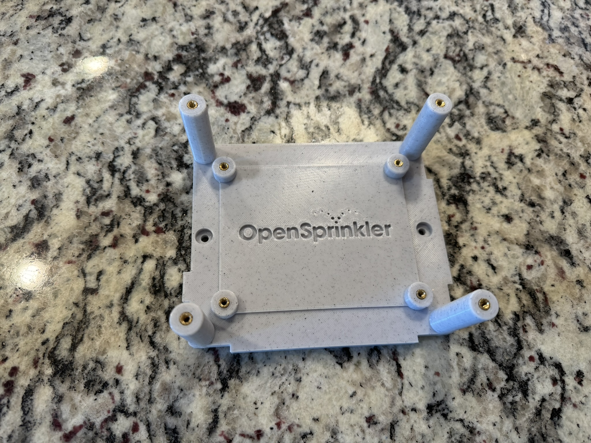
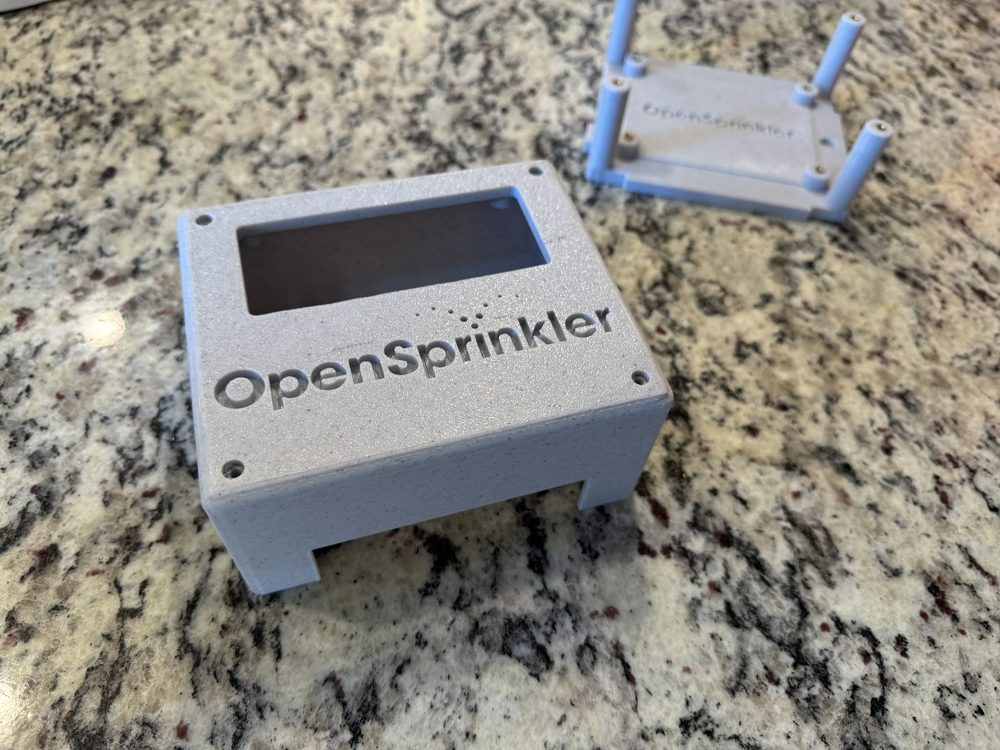
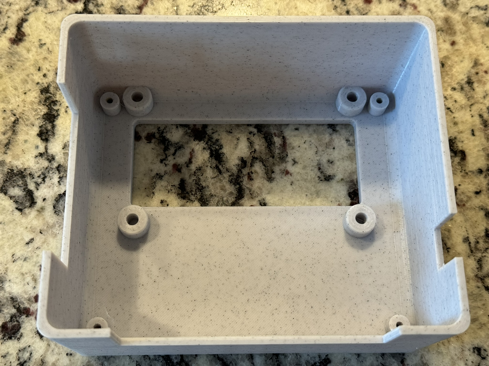
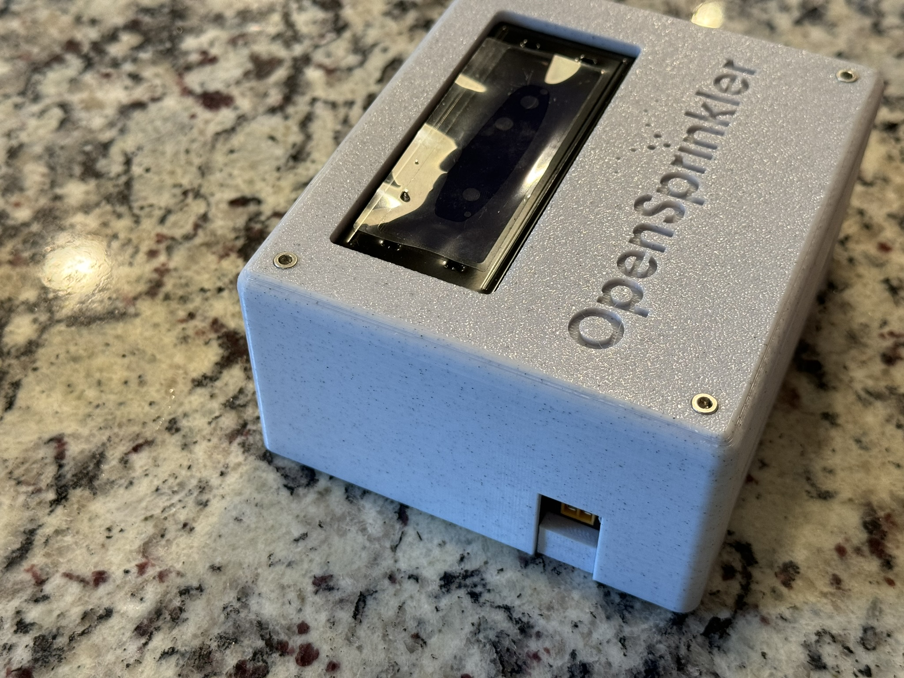

# Ron's OpenSprinkler Case with 20x4 LCD display

## History

 When buying my latest [OpenSprinkler Pi](https://opensprinkler.com) for my current home, I noticed that they no longer provide a case option. The suggest a [case](https://github.com/OpenSprinkler/OpenSprinkler-Hardware/tree/master/OSPi/enclsoure/3Dprint)) to print, but I decided to look for another design. Along the way, I noticed [Stanley's](https://github.com/stanoba/ospiLCD) design that included a 20x4 LCD with code. This intrigued me and I thought I could design something that appealed to me more.

## Why I use OpenSCAD

When it comes to designing 3D things, I have gotten frustrated with most of the "fancy" 3D design software programs but have felt more comfortable with [OpenSCAD](https://openscad.org); I think this is because my brain works bettter with numbers and text than with graphical tools. OpenSCAD uses a scripting language, like many other coding languages, where you can create variables for different measurements; parametric 3D modeling. This allows you to create relative variables and if/than/else statements. You can therefore, make many different changes to the design if you realized that one of your measurements was off by a bit. It also allows you to create re-usable modules that can be incorporated into different designs. One such re-usable module I personally made was for the use of heat-set threaded inserts of various sizes. I am a fan of heat-set threaded inserts because they allow screws to be placed and removed countless times as opposed to biting into the plastic each time and degrading the plastic over time. 

I am still learning more and more with OpenSCAD every time I use it, so I wouldn't consider myself an expert, but I'm at least functional.

## My Design

When designing my case, I did ***not*** want to see the screws that mount the case to the wall. I also wanted to make the design able to be connected and functioning without the cover in place. The only caveat with this design plan is the wires for the LCD; the LCD panel is secured in the cover but needs to connect to the base unit. My plan also was to connect my OpenSprinkler Pi to my network via Ethernet, so I needed to have access to the IO panel on my Raspberry Pi. I finally came up with a design for a bottom and a top.

 

The bottom has some short standoffs with heat-set threaded inserts, using M3 screws, to secure the OSPi control board. There are two spots for #8 wall achor screws to sit flush/below the surface on either side of that board. I then placed four pillars for the top to mount to. The distance from the top to the bottom was random/arbitrary and *may* be a bit too much for some liking, but after I was done with it, I actually liked it. 

The top cover piece has standoffs for heat-set threaded inserts too; again M3x6. To secure the top cover to the bottom piece, I am using M3x16 hex socket screws that fit flush to the top surface.

If you are happy with the design as-is, feel free to just download the STL files and slice them how ever you wish. Due to size limitations of my Ender 3, I printed the top and bottom pieces seperately and I set the top of the cover as the bottom of the print. I arbitrarily used 35% gyroid fill and PLA filament and it worked fine for me.

If you wish to make changes, make sure you have all of the SCAD and SVG files in the same folder. I could not figure out how to properly scale SVG files within OpenSCAD, so I scaled the graphic for the two different uses (below the OSPi board and on the surface of the top cover) so they would be 100% for each use.
