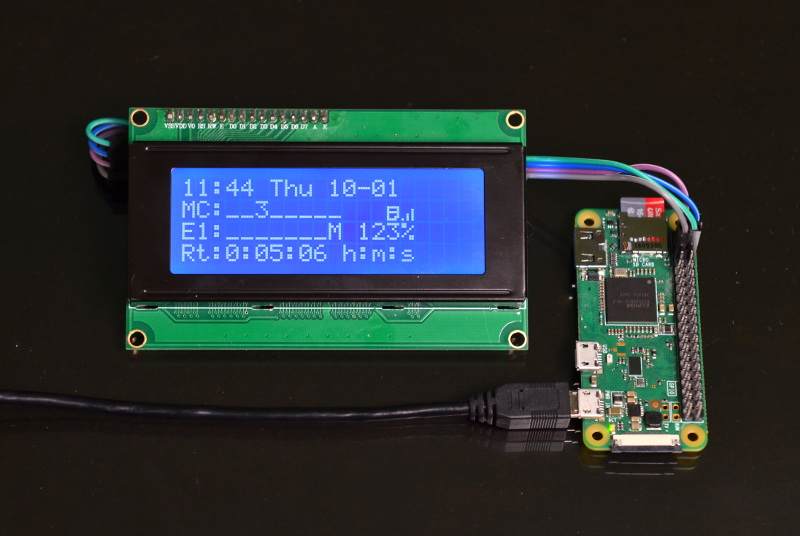
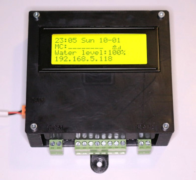
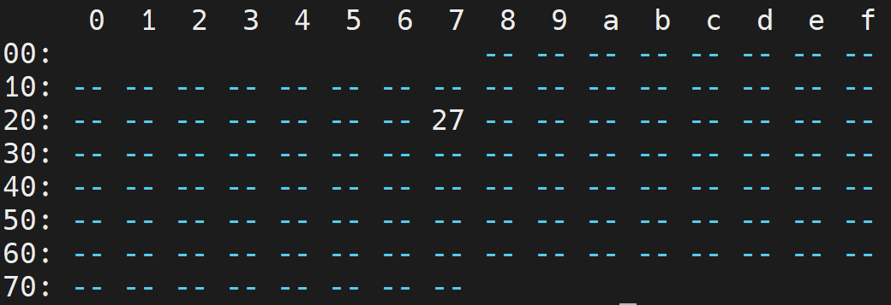
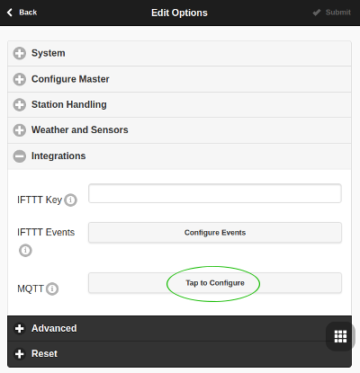
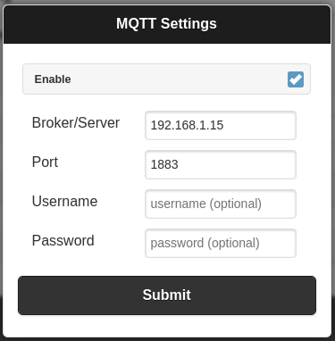

# ospiLCD-mqtt

`ospiLCD-mqtt` provides an LCD status display for OpenSprinkler using a Raspberry Pi and an I2C character LCD.

The program can run directly on an OpenSprinkler Pi (OSPi), providing an LCD on the controller itself, or on a separate Raspberry Pi as a remote OpenSprinkler status display.



## Features

* Supports common 16x2 and 20x4 I2C character LCDs using the RPLCD library.
* Supports PCF8574-based LCD backpacks. Other RPLCD-supported expanders may also work with configuration changes.
* Displays OpenSprinkler controller and station status using icons similar to the OpenSprinkler 2.x LCD.
* On a 20x4 display, additional lines show information such as:
  * Watering level
  * Remaining watering time
  * Expansion-board station status
  * Raspberry Pi network address
* Uses MQTT notifications from OpenSprinkler for immediate display updates when something changes.
* Also performs a periodic OpenSprinkler API refresh as a synchronization fallback.
* Updates the LCD clock once per second without continuously polling the OpenSprinkler API.
* Configurable LCD backlight timeout.
* Can run directly on an OpenSprinkler Pi or on another Raspberry Pi on the network.
* Runs continuously as a systemd service.
* User configuration is stored separately from the Python program, so updating the project does not overwrite local settings.

---

## Project History

This project is based on Stanley's original [`ospiLCD`](https://github.com/stanoba/ospiLCD) project and the subsequent [`ospiLCD-mqtt`](https://github.com/sirkus7/ospiLCD-mqtt) fork.

Stanley's project includes useful information about 3D-printed enclosures, PCB designs, wiring, and other hardware considerations.



The MQTT version differs from the original `ospiLCD` design in two important ways:

1. It runs continuously rather than being launched periodically by cron.
2. It subscribes to OpenSprinkler MQTT events so that changes can be displayed immediately.

MQTT is used as a notification mechanism. When OpenSprinkler publishes an event, `ospiLCD-mqtt` receives the notification and queries the OpenSprinkler API for the current authoritative state.

The current version also performs a full status refresh every 30 seconds as a synchronization fallback. The clock itself is updated locally every second without making an OpenSprinkler API request.

---

# Requirements

You will need:

* A Raspberry Pi running a current Raspberry Pi OS release.
* Python 3 with virtual-environment support.
* An OpenSprinkler system accessible over the network.
* MQTT configured in OpenSprinkler.
* An MQTT broker accessible by both OpenSprinkler and the Raspberry Pi running `ospiLCD-mqtt`.
* A supported I2C character LCD.

This project is currently being developed and tested on:

* Raspberry Pi 2 Model B
* Raspberry Pi OS 13 (Trixie)
* Python 3.13
* OpenSprinkler Pi

Other Raspberry Pi models and Raspberry Pi OS versions should work, but may not have been tested with the current release.

---

# 1. Install and Connect the LCD

Use an I2C character LCD supported by the RPLCD library.

RPLCD documentation:

https://rplcd.readthedocs.io/en/stable/getting_started.html

For information about installing an LCD directly into an OpenSprinkler Pi enclosure, also see Stanley's original project:

https://github.com/stanoba/ospiLCD

A common configuration is:

* 20 columns
* 4 rows
* PCF8574T I2C backpack
* I2C address `0x27`

Your hardware may be different.

## Enable I2C

I2C must be enabled on the Raspberry Pi.

On Raspberry Pi OS, this can normally be done with:

```bash
sudo raspi-config
```

Select:

```text
Interface Options
    → I2C
        → Enable
```

Reboot if requested.

You can verify that the I2C interface exists with:

```bash
ls -l /dev/i2c*
```

To scan I2C bus 1 for connected devices:

```bash
i2cdetect -y 1
```

For example, an LCD backpack using address `0x27` should produce an entry similar to:

<p align="center">
  
</p>

---

# 2. Configure an MQTT Broker

OpenSprinkler has built-in MQTT support.

`ospiLCD-mqtt` does **not** require that the MQTT broker run on the same Raspberry Pi. It only requires that both OpenSprinkler and `ospiLCD-mqtt` can reach the broker.

If you already have an MQTT broker, you can use it and skip to the next section.

One option for running a local broker is Mosquitto:

```bash
sudo apt install mosquitto
```

The exact Mosquitto security and authentication configuration is beyond the scope of this project. Current Mosquitto installations may require additional configuration before accepting remote clients.

---

# 3. Configure MQTT in OpenSprinkler

In the OpenSprinkler web interface:

1. Open **Edit Options**.
2. Select **Integration**.
3. Find **MQTT**.
4. Select **Tap to Configure**.

| OpenSprinkler Integration Settings | MQTT Settings |
| --- | --- |
|  |  |

Configure:

* MQTT broker hostname or IP address
* MQTT port
* Username, if required
* Password, if required

The standard non-TLS MQTT port is commonly `1883`.

Submit the settings and return to the OpenSprinkler main screen.

---

# 4. Download ospiLCD-mqtt

Clone this repository into the location where you want the project installed:

```bash
git clone https://github.com/RonRN18/ospiLCD-mqtt.git
cd ospiLCD-mqtt
```

The project **does not assume** that your username is `pi` or that the repository is located in `/home/pi`.

The installer determines the user and installation directory from the environment in which it is run.

---

# 5. Run the Installer

Run:

```bash
./install.sh
```

Do **not** run the entire installer with `sudo`.

The installer will request `sudo` privileges for individual system-level operations when needed.

The installer:

* Installs required Raspberry Pi OS packages.
* Checks that `/dev/i2c-1` exists.
* Creates a Python virtual environment in `.venv`.
* Installs the Python dependencies listed in `requirements.txt`.
* Creates `ospilcd.ini` from `ospilcd.ini.example` if a local configuration does not already exist.
* Creates a systemd service using your actual username and project directory.
* Does **not** overwrite an existing `ospilcd.ini`.

This last point is important when updating the project: your local configuration remains separate from the code stored in Git.

---

# 6. Configure ospiLCD-mqtt

After installation, edit:

```bash
nano ospilcd.ini
```

The file contains comments describing each option.

A typical configuration looks like:

```ini
[OpenSprinkler]

# IP address or hostname of the OpenSprinkler controller.
# If this script is running directly on the OpenSprinkler Pi,
# 127.0.0.1 is normally appropriate.
address = 127.0.0.1

# OpenSprinkler web/API port.
port = 8080

# MD5 hash of the OpenSprinkler password.
password_hash = a6d82bced638de3def1e9bbb4983225c

[LCD]

# I2C expander used by the LCD backpack.
i2c_expander = PCF8574

# I2C address of the LCD backpack.
i2c_address = 0x27

# LCD dimensions.
columns = 20
rows = 4

# Number of seconds to leave the backlight on after an event.
# See ospilcd.ini.example for current behavior and options.
backlight_timeout = 60


[Regional]

# Locale used for date/time formatting.
locale = en_US.UTF-8
```

Do not edit `ospilcd.ini.example` for your local settings. It is the example configuration distributed with the project and may change in future versions.

Your actual:

```text
ospilcd.ini
```

is excluded from Git by `.gitignore`.

Therefore:

```bash
git pull
```

can update the program without normally replacing your local configuration.

---

## OpenSprinkler Address

If `ospiLCD-mqtt` is running directly on the same Raspberry Pi as OpenSprinkler Pi, normally use:

```ini
address = 127.0.0.1
```

If the display is running on a separate Raspberry Pi, use the hostname or IP address of the OpenSprinkler controller.

For example:

```ini
address = 192.168.1.50
```

The Raspberry Pi running `ospiLCD-mqtt` must be able to reach that address.

---

## OpenSprinkler Password Hash

The OpenSprinkler API uses the MD5 hash of the OpenSprinkler password.

The repository includes `hashpass.py` to assist with generating this value.

Edit `hashpass.py` as necessary and run:

```bash
./hashpass.py
```

Place the resulting hash in:

```ini
password_hash = YOUR_HASH_HERE
```

### Important note for OpenSprinkler Pi users

Some OpenSprinkler Pi firmware update/reinstallation procedures may reset the OpenSprinkler password to the default:

```text
opendoor
```

If you normally use a different password, remember to restore your preferred OpenSprinkler password after updating the firmware.

Otherwise, `ospiLCD-mqtt` may stop being able to query the OpenSprinkler API because the hash in `ospilcd.ini` no longer matches the controller password.

---

# 7. Test the Program

Before relying on the systemd service, it can be useful to run the program interactively.

Activate the virtual environment:

```bash
source .venv/bin/activate
```

Then run:

```bash
python ospiLCD-mqtt.py
```

A successful MQTT connection should produce output similar to:

```text
[Connected with result code Success]
Msg:opensprinkler/availability: b'online'
10:41:20 Wed 08-19
MC:________
Water level:128%
192.168.1.50
```

Press `Ctrl+C` to stop the interactive test.

---

# 8. Start the systemd Service

The installer creates the systemd service using the username and project path detected during installation.

Start it with:

```bash
sudo systemctl start ospilcd
```

Check its status:

```bash
systemctl status ospilcd --no-pager
```

A working installation should report:

```text
Active: active (running)
```

To view recent service messages:

```bash
journalctl -u ospilcd -n 50 --no-pager
```

Once you have confirmed that the service works, enable automatic startup at boot:

```bash
sudo systemctl enable ospilcd
```

You can also enable and start it in one command:

```bash
sudo systemctl enable --now ospilcd
```

---

# How the Display Updates Work

The current version uses three complementary mechanisms.

## MQTT — immediate event updates

OpenSprinkler publishes MQTT messages when events occur.

When `ospiLCD-mqtt` receives one of these messages, it immediately queries the OpenSprinkler API and updates the display.

This avoids waiting for the next polling interval when, for example, a station starts or stops.

## Periodic synchronization — every 30 seconds

A single background task performs a complete API refresh every 30 seconds.

This acts as a synchronization fallback and keeps time-dependent OpenSprinkler information current even when no MQTT event occurs.

## Clock — every second

The first LCD line is updated once per second using the Raspberry Pi system clock.

This update does **not** query OpenSprinkler and does not generate MQTT traffic.

The result is a continuously updating clock without continuously polling the OpenSprinkler API.

Routine display updates write complete LCD rows rather than clearing and redrawing the entire display, reducing the flashing/flickering seen in older versions.

---

# LCD Backlight

The backlight can be configured with:

```ini
backlight_timeout = 60
```

An OpenSprinkler event wakes the backlight and restarts the timeout.

Periodic synchronization and once-per-second clock updates continue while the backlight is off without continually turning it back on.

---

# Updating ospiLCD-mqtt

Because local configuration is stored in the Git-ignored `ospilcd.ini`, normal project updates should not require re-entering your settings.

From the project directory:

```bash
git pull
```

If `requirements.txt` has changed, update the Python environment with:

```bash
.venv/bin/python -m pip install -r requirements.txt
```

Then restart the service:

```bash
sudo systemctl restart ospilcd
```

Check:

```bash
systemctl status ospilcd --no-pager
```

### OpenSprinkler firmware updates

Updating **OpenSprinkler itself** is separate from updating `ospiLCD-mqtt`.

If an OpenSprinkler Pi firmware update resets your OpenSprinkler password, restore the intended password afterward or update the hash in `ospilcd.ini`.

If the LCD stops displaying current OpenSprinkler information immediately after an OpenSprinkler firmware update, checking the OpenSprinkler password is a good first troubleshooting step.

---

# Troubleshooting

## LCD is powered but displays no information

First verify that I2C is enabled:

```bash
ls -l /dev/i2c*
```

Then scan the bus:

```bash
i2cdetect -y 1
```

Verify that the detected address matches:

```ini
i2c_address =
```

in `ospilcd.ini`.

A common address is:

```text
0x27
```

but your LCD may use another address.

---

## `ModuleNotFoundError`

Make sure you are using the project's virtual environment.

Instead of:

```bash
python3 ospiLCD-mqtt.py
```

use:

```bash
source .venv/bin/activate
python ospiLCD-mqtt.py
```

or directly:

```bash
.venv/bin/python ospiLCD-mqtt.py
```

Dependencies can be reinstalled with:

```bash
.venv/bin/python -m pip install -r requirements.txt
```

---

## MQTT does not connect

Verify the MQTT configuration in the OpenSprinkler web interface and verify that the broker is reachable from the Raspberry Pi.

The display may initially show:

```text
Connecting to
MQTT broker...
```

A successful connection should briefly show:

```text
MQTT Connected
Requesting info
```

---

## MQTT connects but OpenSprinkler data does not appear

Verify:

```ini
[OpenSprinkler]
address =
port =
password_hash =
```

If running directly on the OpenSprinkler Pi, try:

```ini
address = 127.0.0.1
```

Also verify that the password hash corresponds to the OpenSprinkler controller's **current** password.

---

## Service will not start

Check:

```bash
systemctl status ospilcd --no-pager
```

and:

```bash
journalctl -u ospilcd -n 50 --no-pager
```

If you manually change the systemd service file, reload systemd before restarting:

```bash
sudo systemctl daemon-reload
sudo systemctl restart ospilcd
```

---

# Configuration Files

| File | Purpose |
| --- | --- |
| `ospiLCD-mqtt.py` | Main program |
| `ospilcd.ini.example` | Example/documented configuration |
| `ospilcd.ini` | Your local configuration; not tracked by Git |
| `requirements.txt` | Python dependencies |
| `install.sh` | Installation helper |
| `hashpass.py` | Utility for generating the OpenSprinkler password hash |
| `.gitignore` | Prevents local configuration and virtual environment from being committed |
| `.gitattributes` | Ensures shell scripts retain Unix line endings |

---

# Notes About This Project

This project began as a practical attempt to add a useful LCD display to OpenSprinkler Pi.

The OpenSprinkler firmware itself is written primarily in C++, and integrating LCD support directly into the firmware would ultimately be preferable. Native integration could react directly to internal OpenSprinkler state without requiring a separate Python process, MQTT notifications, and API requests.

Until such functionality exists in OpenSprinkler Pi itself, this project provides a practical alternative.

The current Python implementation minimizes unnecessary work by using MQTT for immediate event notification, a relatively infrequent API synchronization interval, and a lightweight local clock update.

If OpenSprinkler Pi eventually gains native LCD support and makes this project obsolete, that would be a welcome outcome.

---

# Credits

This project builds upon the work of:

* Stanley's `ospiLCD`:
  https://github.com/stanoba/ospiLCD
* sirkus7's `ospiLCD-mqtt`:
  https://github.com/sirkus7/ospiLCD-mqtt

Thanks to the OpenSprinkler project and the developers of RPLCD and Eclipse Paho MQTT.

---

# Helpful References

* Stanley's ospiLCD project:
  https://github.com/stanoba/ospiLCD
* RPLCD documentation:
  https://rplcd.readthedocs.io/en/stable/
* OpenSprinkler API documentation:
  https://openthings.freshdesk.com/support/solutions/articles/5000716363-os-api-documents
* OpenSprinkler:
  https://opensprinkler.com/
